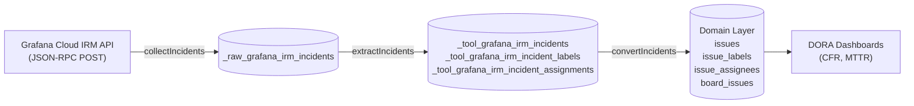

<!--
Licensed to the Apache Software Foundation (ASF) under one or more
contributor license agreements.  See the NOTICE file distributed with
this work for additional information regarding copyright ownership.
The ASF licenses this file to You under the Apache License, Version 2.0
(the "License"); you may not use this file except in compliance with
the License.  You may obtain a copy of the License at

    http://www.apache.org/licenses/LICENSE-2.0

Unless required by applicable law or agreed to in writing, software
distributed under the License is distributed on an "AS IS" BASIS,
WITHOUT WARRANTIES OR CONDITIONS OF ANY KIND, either express or implied.
See the License for the specific language governing permissions and
limitations under the License.
-->

# Grafana IRM Plugin

## Summary

The `grafana_irm` plugin connects Apache DevLake to **Grafana Cloud Incident Response & Management (IRM)**. It ingests incident records, assignments, and labels into DevLake and transforms them into standardized domain models (`Issue`, `IssueAssignee`, `IssueLabel`, and `BoardIssue`) to calculate key DORA metrics:

- **Change Failure Rate (CFR)**
- **Mean Time to Recovery / Failed Deployment Recovery Time (MTTR)**

This plugin follows the established incident-management pattern used by DevLake plugins like `pagerduty` and `incidentio`.

---

## What It Collects

### Source API Endpoints

Grafana IRM uses a JSON-RPC HTTP POST API under `/api/plugins/grafana-irm-app/resources/api/v1/`:

| RPC Method | Purpose |
| :--- | :--- |
| `IncidentsService.QueryIncidents` | Query incident list with pagination, date bounds, and drill filters |
| `IncidentsService.GetIncident` | Fetch details for open / active incidents during the refresh pass |

### Database Tables

#### Tool Layer
- `_tool_grafana_irm_connections`: Connection configurations
- `_tool_grafana_irm_scopes`: Data scopes (connection-wide incident feed)
- `_tool_grafana_irm_scope_configs`: Scope transformation configurations
- `_tool_grafana_irm_incidents`: Incident metadata, severities, durations, and timestamps
- `_tool_grafana_irm_incident_labels`: Key-value labels attached to incidents
- `_tool_grafana_irm_incident_assignments`: Role-based incident responder assignments

#### Domain Layer
- `issues`: Standardized issue entity (`type = 'INCIDENT'`)
- `board_issues`: Mapping of incidents to the connection scope board
- `issue_labels`: Incident labels (useful for team/service breakdown in SQL/Grafana)
- `issue_assignees`: Incident assignees and roles (commander, investigator, etc.)

---

## Data Flow

### Pipeline Subtasks

The plugin executes three subtasks in order:
1. `collectIncidents`: Pulls new and updated incidents from Grafana Cloud using cursor pagination and re-fetches unresolved incidents.
2. `extractIncidents`: Extracts raw JSON payloads into tool-layer tables.
3. `convertIncidents`: Transforms tool records into standardized DevLake domain tables for DORA analysis.

---

## Collection Strategy & Sync Architecture

1. **Incremental Collection**:
   - Uses query DSL date ranges: `isdrill:false or(declared:<since>,<until> resolved:<since>,<until>)`.
   - Filters out drill/simulation incidents server-side to avoid polluting production DORA metrics.
2. **Unified `FinalizableApiCollector`**:
   - Implements both new incident listing and open-incident refresh within a single `FinalizableApiCollector` subtask.
   - On full syncs, the refresh phase is bypassed by design to prevent raw table clobbering.
   - On "Re-transform Data", the entire collector is cleanly bypassed without dropping previously resolved incidents.
3. **Smart Skip for Unchanged Incidents**:
   - When refreshing open incidents, the collector passes `X-Devlake-Known-Modified` headers.
   - If the remote incident has not changed since the last sync, insertion into the raw table is skipped to prevent table bloating.

---

## Setup & Configuration

### Prerequisites

1. An active **Grafana Cloud** stack with IRM (Incident Response & Management) enabled.
2. A **Grafana Cloud Service Account Token** with permissions to read incidents (`Incident: Read` or viewer/editor role on the IRM app).
   > **Note:** On brand-new stacks, open the IRM app in your Grafana Cloud web UI at least once before creating API connections to trigger internal org provisioning.

### Step 1 — Create Connection

1. In DevLake Config UI (`http://localhost:4000`), navigate to **Connections** → **Add Connection** → select **Grafana IRM**.
2. Configure the following fields:
   - **Connection Name**: A memorable name for your stack (e.g. `Production Grafana IRM`).
   - **Grafana Cloud Stack URL**: The base URL of your Grafana Cloud instance (e.g. `https://mycompany.grafana.net/`).
   - **Service Account Token**: The bearer token generated from Grafana Cloud (e.g. `glsa_...`).
   - **Rate Limit**: Optional hourly request limit (defaults to `3,600` requests/hour).
3. Click **Test Connection**. Once verified, click **Save Connection**.

### Step 2 — Add Data Scope

1. Click **Add Data Scope** for the saved connection.
2. Select the **All Incidents** scope checkbox.
   - Grafana IRM manages incidents globally across the stack; selecting "All Incidents" ingests the organization's incident stream.
3. Click **Save Scope**.

### Step 3 — Collect Data in a Project

1. Navigate to **Projects** from the sidebar and open your target project (or create a new one).
2. Under **Project Metrics**, ensure **DORA Metrics** is enabled.
3. Click **Add Connection** and select your Grafana IRM connection with the **All Incidents** scope.
4. Configure your sync frequency and historical date range, then click **Save**.
5. Trigger or wait for the blueprint pipeline run to complete.

---

## Domain Mapping Reference

| Grafana IRM Field | DevLake Domain Field (`issues`) | Notes |
| :--- | :--- | :--- |
| `incidentID` | `original_id` | Unique incident ID |
| `title` | `title` | Incident title / summary |
| `status` | `status`, `original_status` | Mapped to `DONE` (`resolved`) or `IN_PROGRESS` (`active`) |
| `severity` | `severity`, `priority` | Critical, Major, Minor |
| `createdTime` / `incidentStart` | `created_date` | Incident declaration time |
| `closedTime` / `incidentEnd` | `resolution_date` | Incident resolution timestamp (empty if unresolved) |
| `durationSeconds` | `lead_time_minutes` | Converted to minutes for MTTR calculations |
| `labels[]` | `issue_labels` (join table) | Ingested as key-value label rows (`label_key:label`) |
| `assignments[]` | `issue_assignees` (join table) | User assignments and roles (e.g. `commander`) |
| `isDrill` | *Filtered out* | Filtered server-side (`isdrill:false`) |

---

## Troubleshooting

| Issue | Cause & Resolution |
| :--- | :--- |
| **401 Unauthorized** on Test Connection | Invalid token, expired token, or token lacks IRM access. Verify service account permissions in Grafana Cloud. |
| **User not found / Org not found** | Brand new stack where IRM was never opened. Log in to Grafana Cloud and click into the IRM application once to complete initial org setup. |
| **Rate Limit (429)** | Exceeded Grafana Cloud API limits. Adjust `rateLimitPerHour` in connection settings or wait for rate limit window reset. |
| **Missing incidents in DORA metrics** | Check that deployments are configured in DevLake so incidents can be correlated with deployments. Also verify whether the incidents were drills (`isDrill: true`), which are intentionally excluded. |
